# Skill Path UML

This document is generated from `internal/domain/tree_catalog.go`.

Each diagram is emitted as PlantUML source plus a rendered SVG so the skill DAGs can be reviewed visually in the repo.

Regenerate with `go run ./cmd/generate-skill-path-docs`.

## Legend

- Node color reflects the node stage within that path.
- Seed nodes use a stronger border.
- Arrows point from prerequisite to unlocked node.
- All diagrams are generated from the validated built-in tree definitions, so they reflect the current DAG structure exactly.

## Public Tracks

### Story Craft Track

- Slug: `story-craft-track`
- Nodes: `52`
- Prerequisite edges: `59`
- Seeds: `story-causal-clarity`, `story-scene-architecture`, `story-prose-precision`
- Priority skills: `narrative clarity`, `scene architecture`, `prose precision`, `emotional compression`, `dialogue intelligence`, `image freshness`, `worldbuilding economy`
- Stage mix: `core=9, scene=7, character=8, world=6, style=7, structure=6, revision=9`
- UML source: [story-craft-track.puml](diagrams/skill-paths/story-craft-track.puml)
- SVG: [story-craft-track.svg](diagrams/skill-paths/story-craft-track.svg)

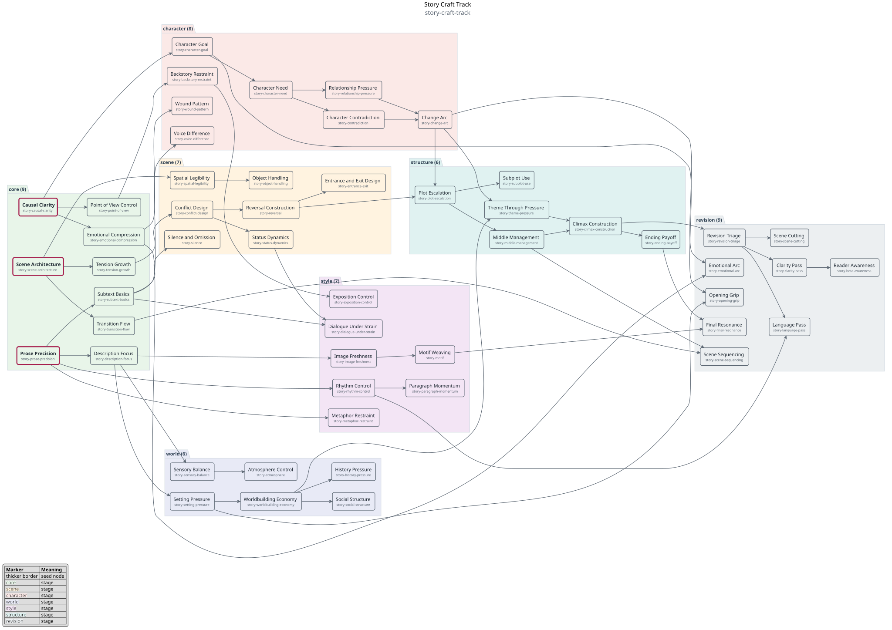

### Fantasy Track

- Slug: `fantasy-fiction-track`
- Nodes: `52`
- Prerequisite edges: `59`
- Seeds: `fantasy-story-causal-clarity`, `fantasy-story-scene-architecture`, `fantasy-story-prose-precision`
- Priority skills: `worldbuilding economy`, `image freshness`, `scene architecture`, `narrative clarity`, `dialogue intelligence`, `emotional compression`, `prose precision`
- Stage mix: `core=9, scene=7, character=8, world=6, style=7, structure=6, revision=9`
- UML source: [fantasy-fiction-track.puml](diagrams/skill-paths/fantasy-fiction-track.puml)
- SVG: [fantasy-fiction-track.svg](diagrams/skill-paths/fantasy-fiction-track.svg)

### Science Fiction Track

- Slug: `science-fiction-track`
- Nodes: `52`
- Prerequisite edges: `59`
- Seeds: `scifi-story-causal-clarity`, `scifi-story-scene-architecture`, `scifi-story-prose-precision`
- Priority skills: `worldbuilding economy`, `narrative clarity`, `scene architecture`, `prose precision`, `dialogue intelligence`, `image freshness`, `structure and pacing`
- Stage mix: `core=9, scene=7, character=8, world=6, style=7, structure=6, revision=9`
- UML source: [science-fiction-track.puml](diagrams/skill-paths/science-fiction-track.puml)
- SVG: [science-fiction-track.svg](diagrams/skill-paths/science-fiction-track.svg)

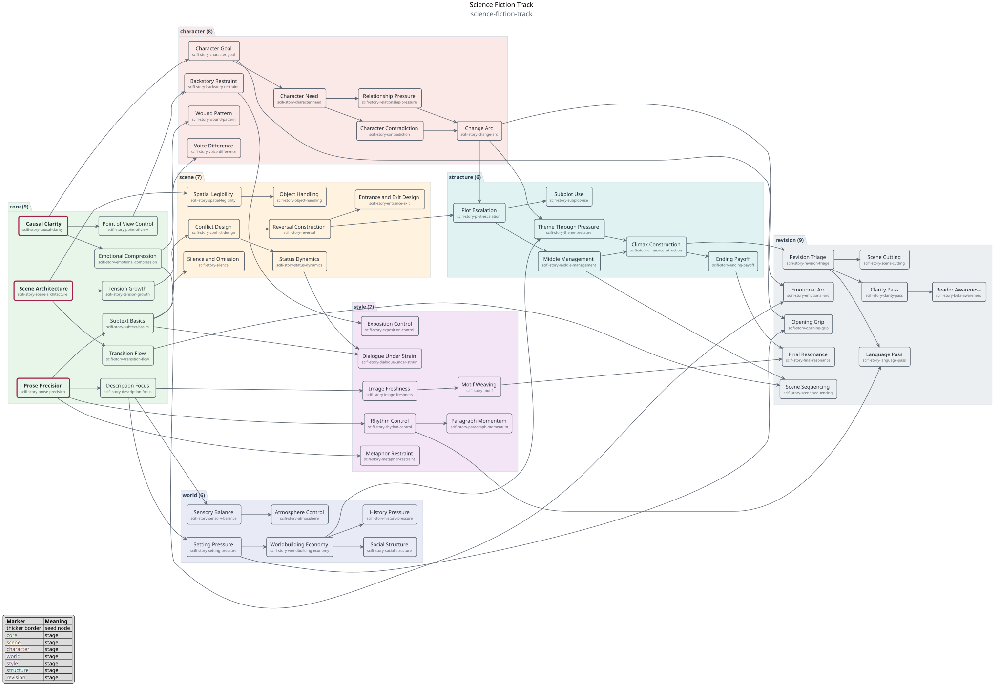

### Romance Track

- Slug: `romance-fiction-track`
- Nodes: `52`
- Prerequisite edges: `59`
- Seeds: `romance-story-causal-clarity`, `romance-story-scene-architecture`, `romance-story-prose-precision`
- Priority skills: `scene architecture`, `emotional compression`, `dialogue intelligence`, `story development`, `narrative clarity`, `voice presence`, `prose precision`
- Stage mix: `core=9, scene=7, character=8, world=6, style=7, structure=6, revision=9`
- UML source: [romance-fiction-track.puml](diagrams/skill-paths/romance-fiction-track.puml)
- SVG: [romance-fiction-track.svg](diagrams/skill-paths/romance-fiction-track.svg)

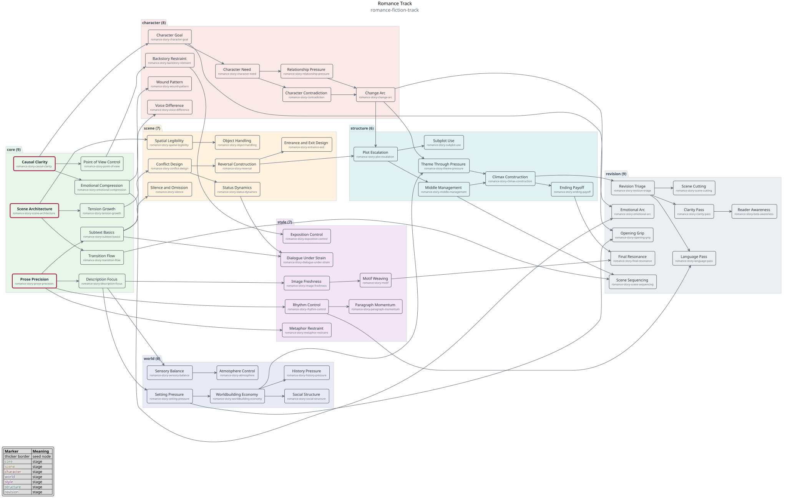

### Literary Fiction Track

- Slug: `literary-fiction-track`
- Nodes: `52`
- Prerequisite edges: `59`
- Seeds: `literary-story-causal-clarity`, `literary-story-scene-architecture`, `literary-story-prose-precision`
- Priority skills: `image freshness`, `emotional compression`, `prose precision`, `narrative clarity`, `scene architecture`, `dialogue intelligence`, `story development`
- Stage mix: `core=9, scene=7, character=8, world=6, style=7, structure=6, revision=9`
- UML source: [literary-fiction-track.puml](diagrams/skill-paths/literary-fiction-track.puml)
- SVG: [literary-fiction-track.svg](diagrams/skill-paths/literary-fiction-track.svg)

### Mystery and Thriller Track

- Slug: `mystery-thriller-track`
- Nodes: `52`
- Prerequisite edges: `59`
- Seeds: `thriller-story-causal-clarity`, `thriller-story-scene-architecture`, `thriller-story-prose-precision`
- Priority skills: `narrative clarity`, `scene architecture`, `structure and pacing`, `dialogue intelligence`, `worldbuilding economy`, `prose precision`, `story development`
- Stage mix: `core=9, scene=7, character=8, world=6, style=7, structure=6, revision=9`
- UML source: [mystery-thriller-track.puml](diagrams/skill-paths/mystery-thriller-track.puml)
- SVG: [mystery-thriller-track.svg](diagrams/skill-paths/mystery-thriller-track.svg)

### Thought Leadership Track

- Slug: `thought-leadership-track`
- Nodes: `52`
- Prerequisite edges: `49`
- Seeds: `claim-clarity`, `audience-alignment`, `sentence-economy`
- Priority skills: `claim clarity`, `audience alignment`, `sentence economy`, `structural signposting`, `insight density`, `evidence integration`, `authority and voice`, `clarity and coherence`
- Stage mix: `core=8, structure=7, insight=7, evidence=7, voice=7, audience=6, advanced=4, revision=6`
- UML source: [thought-leadership-track.puml](diagrams/skill-paths/thought-leadership-track.puml)
- SVG: [thought-leadership-track.svg](diagrams/skill-paths/thought-leadership-track.svg)

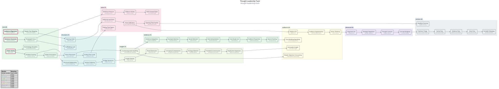

### Professional Writing Track

- Slug: `professional-writing-track`
- Nodes: `52`
- Prerequisite edges: `49`
- Seeds: `objective-clarity`, `professional-audience-alignment`, `professional-sentence-economy`
- Priority skills: `clarity and coherence`, `audience alignment`, `sentence economy`, `structural signposting`, `tone calibration`, `actionability`, `scannability`, `evidence integration`
- Stage mix: `core=9, structure=8, tone=7, forms=5, analysis=7, scanning=5, advanced=5, revision=6`
- UML source: [professional-writing-track.puml](diagrams/skill-paths/professional-writing-track.puml)
- SVG: [professional-writing-track.svg](diagrams/skill-paths/professional-writing-track.svg)

### Marketing Writing Track

- Slug: `marketing-writing-track`
- Nodes: `52`
- Prerequisite edges: `49`
- Seeds: `marketing-claim-clarity`, `marketing-audience-alignment`, `marketing-sentence-economy`
- Priority skills: `audience alignment`, `claim clarity`, `actionability`, `sentence economy`, `structural signposting`, `rhetorical force`, `evidence integration`
- Stage mix: `core=8, structure=7, insight=7, evidence=7, voice=7, audience=6, advanced=4, revision=6`
- UML source: [marketing-writing-track.puml](diagrams/skill-paths/marketing-writing-track.puml)
- SVG: [marketing-writing-track.svg](diagrams/skill-paths/marketing-writing-track.svg)

### Content Marketing Track

- Slug: `content-marketing-track`
- Nodes: `52`
- Prerequisite edges: `57`
- Seeds: `content-persuasive-claim`, `content-persuasive-audience`, `content-persuasive-reasoning`
- Priority skills: `audience alignment`, `claim clarity`, `insight density`, `structural signposting`, `actionability`, `evidence integration`, `rhetorical force`
- Stage mix: `core=10, structure=6, appeal=7, objection=6, evidence=5, style=6, advanced=4, revision=8`
- UML source: [content-marketing-track.puml](diagrams/skill-paths/content-marketing-track.puml)
- SVG: [content-marketing-track.svg](diagrams/skill-paths/content-marketing-track.svg)

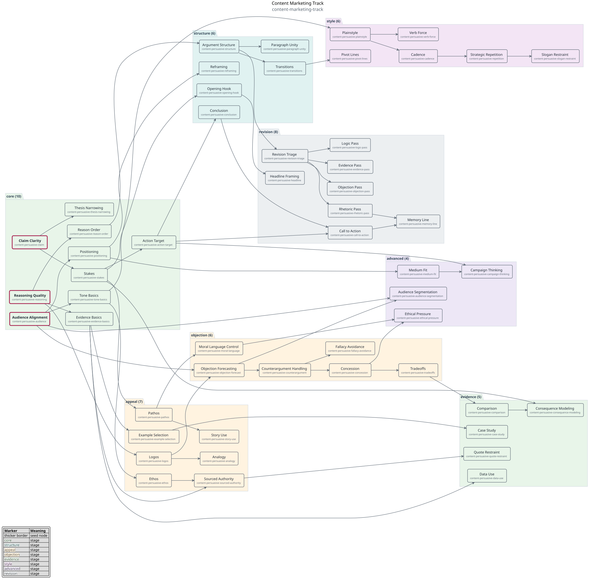

### Journalism and Reporting Track

- Slug: `journalism-reporting-track`
- Nodes: `52`
- Prerequisite edges: `49`
- Seeds: `journalism-claim-clarity`, `journalism-audience-alignment`, `journalism-sentence-economy`
- Priority skills: `clarity and coherence`, `structural signposting`, `evidence integration`, `authority and voice`, `audience alignment`, `sentence economy`, `insight density`
- Stage mix: `core=8, structure=7, insight=7, evidence=7, voice=7, audience=6, advanced=4, revision=6`
- UML source: [journalism-reporting-track.puml](diagrams/skill-paths/journalism-reporting-track.puml)
- SVG: [journalism-reporting-track.svg](diagrams/skill-paths/journalism-reporting-track.svg)

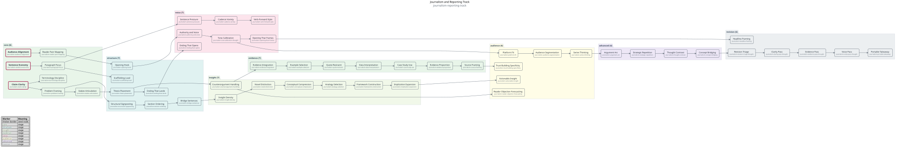

### Educational Writing Track

- Slug: `educational-writing-track`
- Nodes: `52`
- Prerequisite edges: `56`
- Seeds: `education-academic-thesis-clarity`, `education-academic-structure-basics`, `education-academic-evidence-basics`
- Priority skills: `clarity and coherence`, `structural signposting`, `evidence integration`, `actionability`, `scannability`, `analysis depth`, `audience alignment`
- Stage mix: `core=10, structure=6, analysis=8, research=9, style=7, revision=12`
- UML source: [educational-writing-track.puml](diagrams/skill-paths/educational-writing-track.puml)
- SVG: [educational-writing-track.svg](diagrams/skill-paths/educational-writing-track.svg)

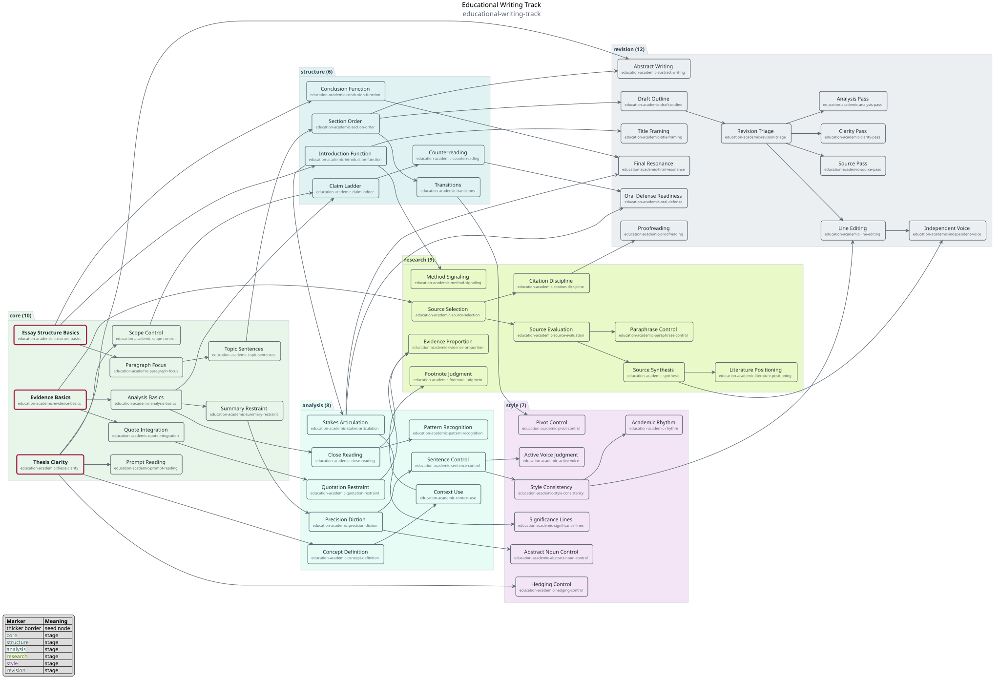

### Grant Writing Track

- Slug: `grant-writing-track`
- Nodes: `52`
- Prerequisite edges: `49`
- Seeds: `grant-objective-clarity`, `grant-professional-audience-alignment`, `grant-professional-sentence-economy`
- Priority skills: `claim clarity`, `evidence integration`, `structural signposting`, `audience alignment`, `actionability`, `clarity and coherence`, `sentence economy`
- Stage mix: `core=9, structure=8, tone=7, forms=5, analysis=7, scanning=5, advanced=5, revision=6`
- UML source: [grant-writing-track.puml](diagrams/skill-paths/grant-writing-track.puml)
- SVG: [grant-writing-track.svg](diagrams/skill-paths/grant-writing-track.svg)

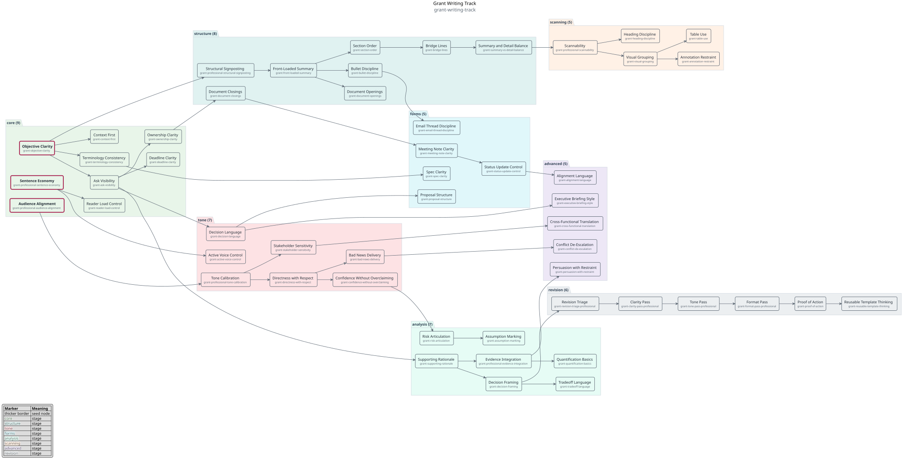

### Academic Essay Track

- Slug: `academic-essay-track`
- Nodes: `52`
- Prerequisite edges: `56`
- Seeds: `academic-thesis-clarity`, `academic-structure-basics`, `academic-evidence-basics`
- Priority skills: `thesis clarity`, `evidence integration`, `structural signposting`, `analysis depth`, `source handling`, `clarity and coherence`, `revision habits`
- Stage mix: `core=10, structure=6, analysis=8, research=9, style=7, revision=12`
- UML source: [academic-essay-track.puml](diagrams/skill-paths/academic-essay-track.puml)
- SVG: [academic-essay-track.svg](diagrams/skill-paths/academic-essay-track.svg)

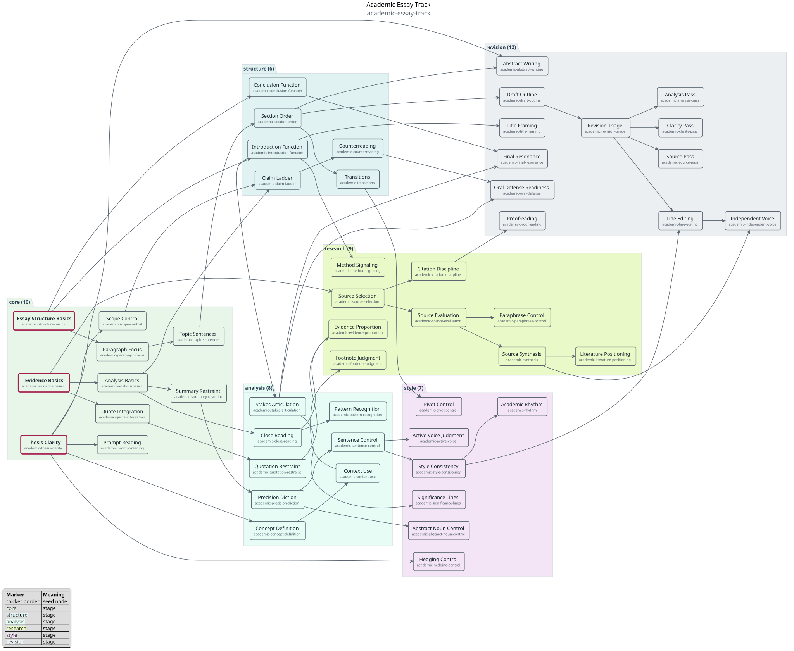

### Technical Writing Track

- Slug: `technical-writing-track`
- Nodes: `52`
- Prerequisite edges: `49`
- Seeds: `technical-user-goal`, `technical-structure-basics`, `technical-step-clarity`
- Priority skills: `user goal alignment`, `structural signposting`, `actionability`, `scannability`, `accuracy`, `example quality`, `technical precision`
- Stage mix: `core=10, structure=9, examples=6, reference=6, support=6, style=4, revision=11`
- UML source: [technical-writing-track.puml](diagrams/skill-paths/technical-writing-track.puml)
- SVG: [technical-writing-track.svg](diagrams/skill-paths/technical-writing-track.svg)

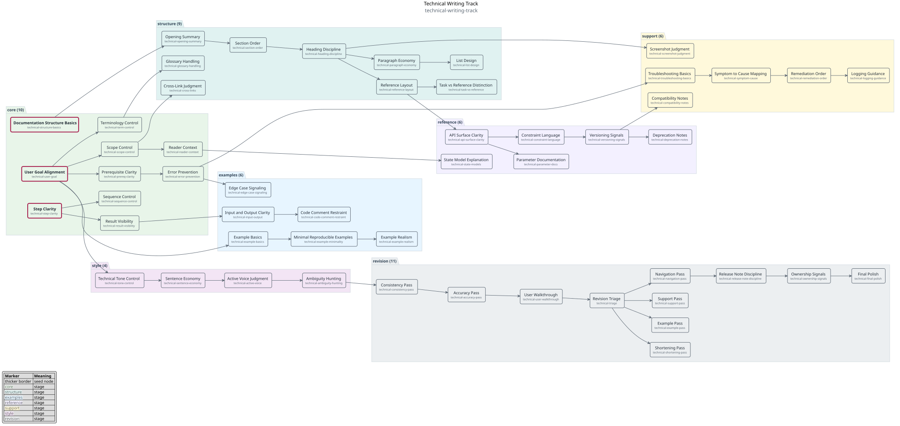

### Persuasive Writing Track

- Slug: `persuasive-writing-track`
- Nodes: `52`
- Prerequisite edges: `57`
- Seeds: `persuasive-claim`, `persuasive-audience`, `persuasive-reasoning`
- Priority skills: `claim clarity`, `audience alignment`, `reasoning quality`, `evidence integration`, `rhetorical force`, `objection handling`, `actionability`
- Stage mix: `core=10, structure=6, appeal=7, objection=6, evidence=5, style=6, advanced=4, revision=8`
- UML source: [persuasive-writing-track.puml](diagrams/skill-paths/persuasive-writing-track.puml)
- SVG: [persuasive-writing-track.svg](diagrams/skill-paths/persuasive-writing-track.svg)

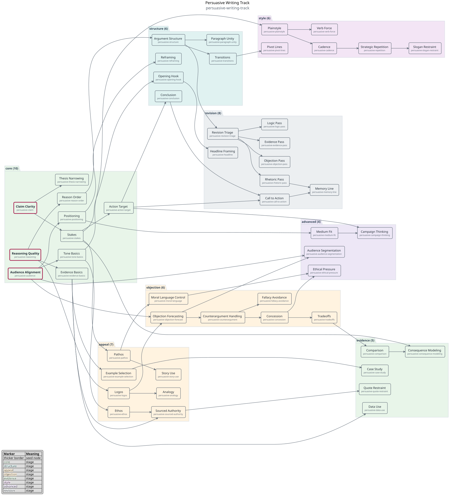

### Memoir and Personal Narrative Track

- Slug: `memoir-personal-narrative-track`
- Nodes: `52`
- Prerequisite edges: `54`
- Seeds: `memoir-scene-grounding`, `memoir-voice-presence`, `memoir-reflection-basics`
- Priority skills: `scene architecture`, `voice presence`, `reflection depth`, `emotional compression`, `narrative clarity`, `image freshness`, `revision habits`
- Stage mix: `core=10, scene=6, voice=6, reflection=7, character=7, structure=6, style=4, revision=6`
- UML source: [memoir-personal-narrative-track.puml](diagrams/skill-paths/memoir-personal-narrative-track.puml)
- SVG: [memoir-personal-narrative-track.svg](diagrams/skill-paths/memoir-personal-narrative-track.svg)

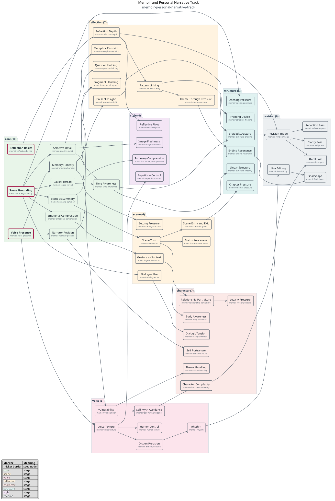

## Internal Templates

### Youth Writing Foundations

- Slug: `youth-writing-foundations`
- Nodes: `52`
- Prerequisite edges: `63`
- Seeds: `word-choice`, `sentence-variety`, `sentence-clarity`
- Priority skills: `word choice`, `sentence variety`, `clarity and coherence`, `paragraph control`, `narrative sequencing`, `descriptive precision`, `dialogue basics`
- Stage mix: `foundation=10, paragraph=8, story=10, dialogue=6, forms=6, revision=12`
- UML source: [youth-writing-foundations.puml](diagrams/skill-paths/youth-writing-foundations.puml)
- SVG: [youth-writing-foundations.svg](diagrams/skill-paths/youth-writing-foundations.svg)

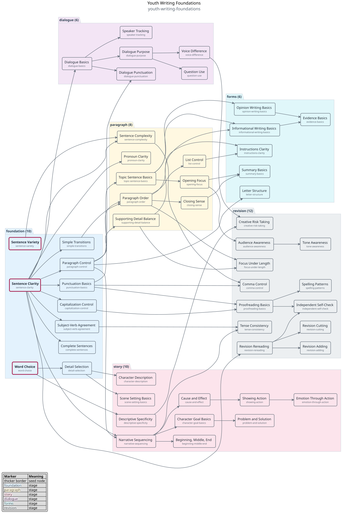

